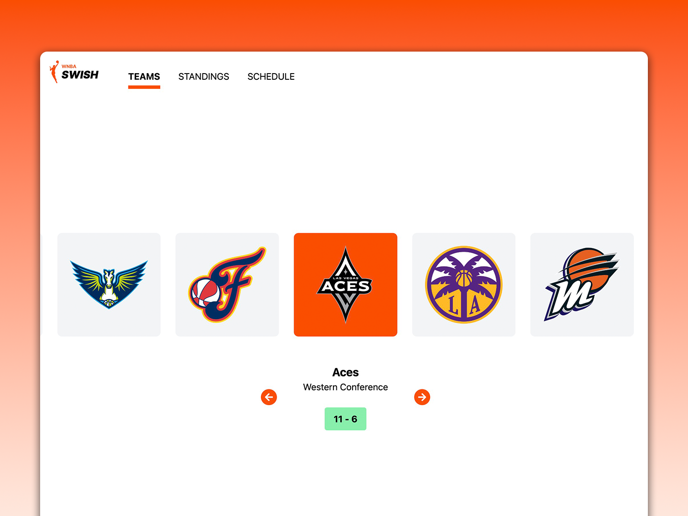
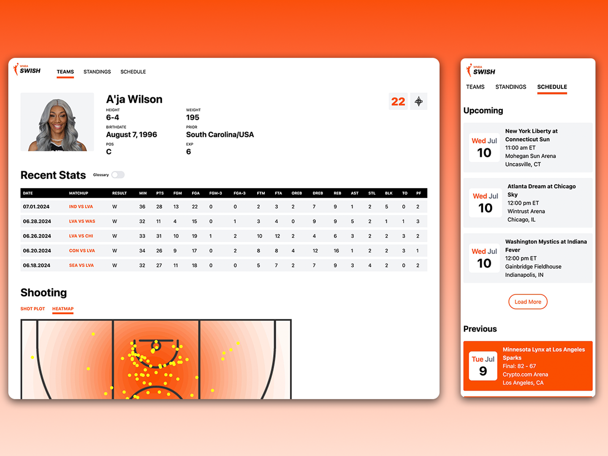
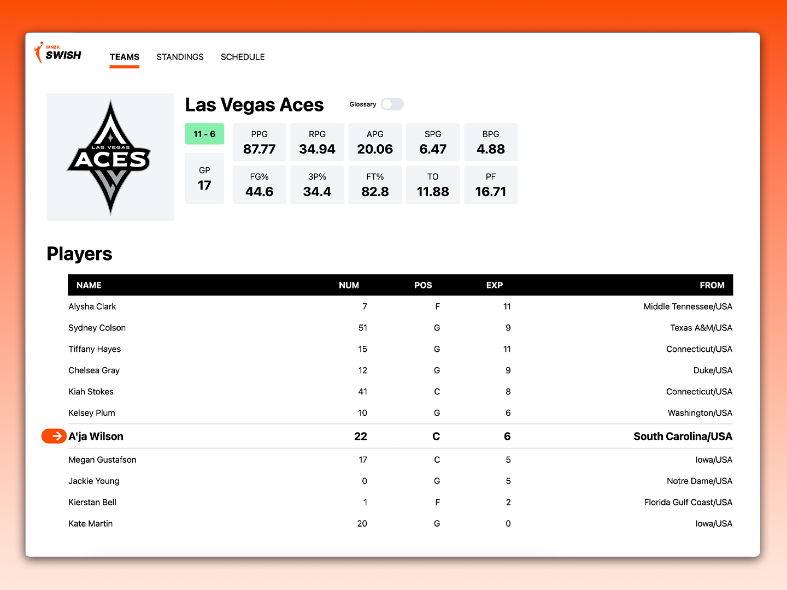

# WNBA Swish

WNBA Swish is a web application that provides up-to-date information on WNBA games, including team stats, player stats, schedules, scores, and standings. The app aims to offer a comprehensive view of the current 2024 WNBA season, making it easy for fans to stay informed about their favorite teams and players.

My personal favorite team is the Las Vegas Aces. Let's get a three-peat!

:arrow_right: [Live Preview](https://wnba-swish.vercel.app/)

## Screenshots

## Features

-   See the current standings of WNBA teams with win-loss records and color-coded win-loss ratios
-   Analyze player stats from their most recent 5 games and visualize shooting metrics
-   View upcoming WNBA games with details like date, time, teams, and location
-   Data is updated daily to ensure the latest information is available

## Tech Stack

React, TypeScript, JavaScript, Tailwind, Express, Node.js, PostgreSQL, Vite, Swiper.js, D3.js, React-Router-DOM, Framer Motion
